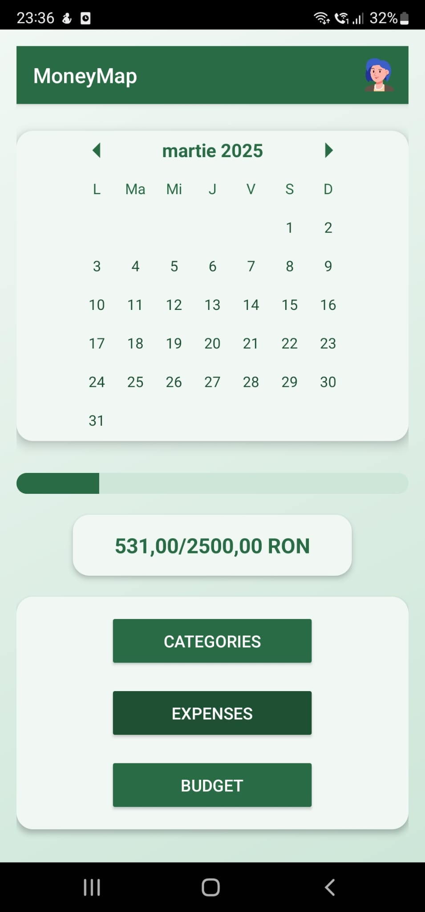
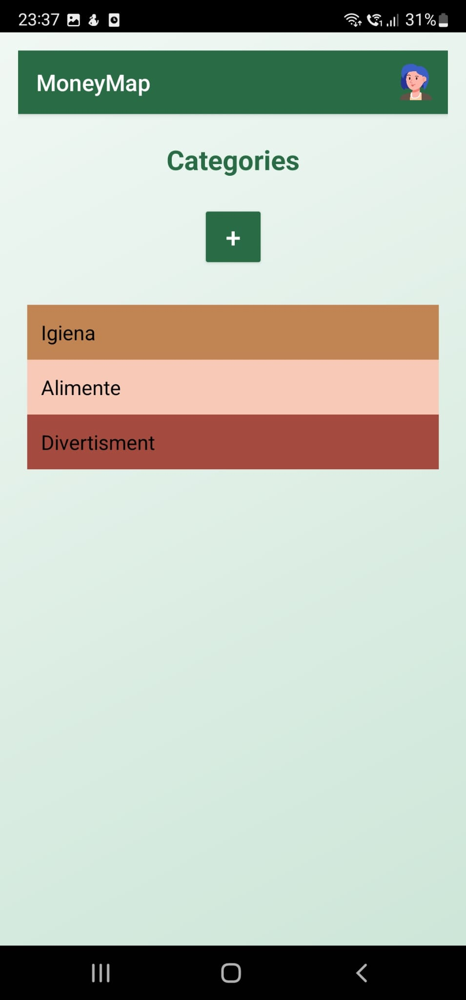
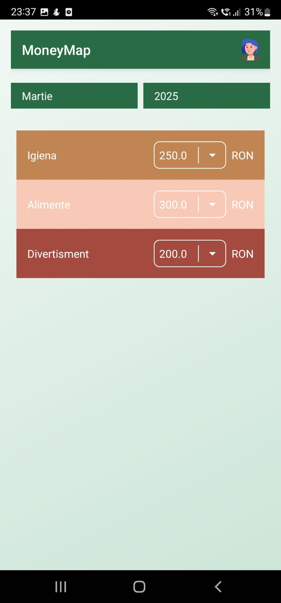
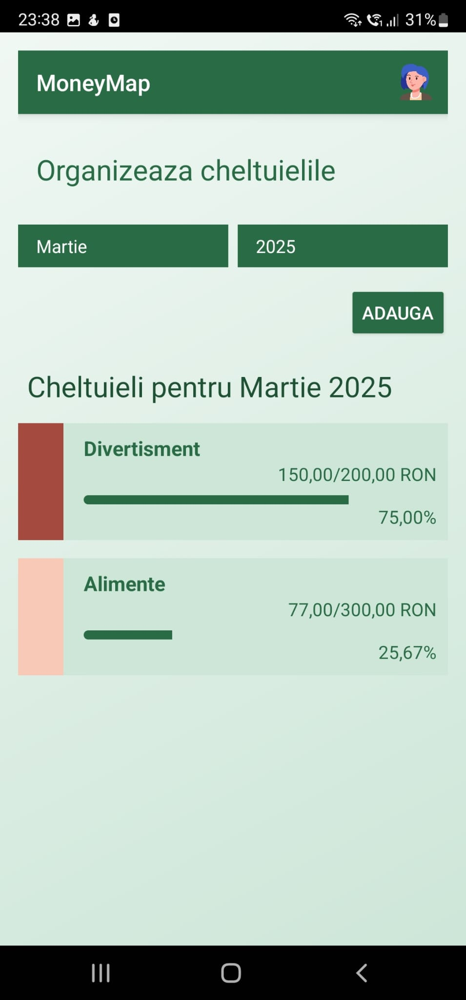
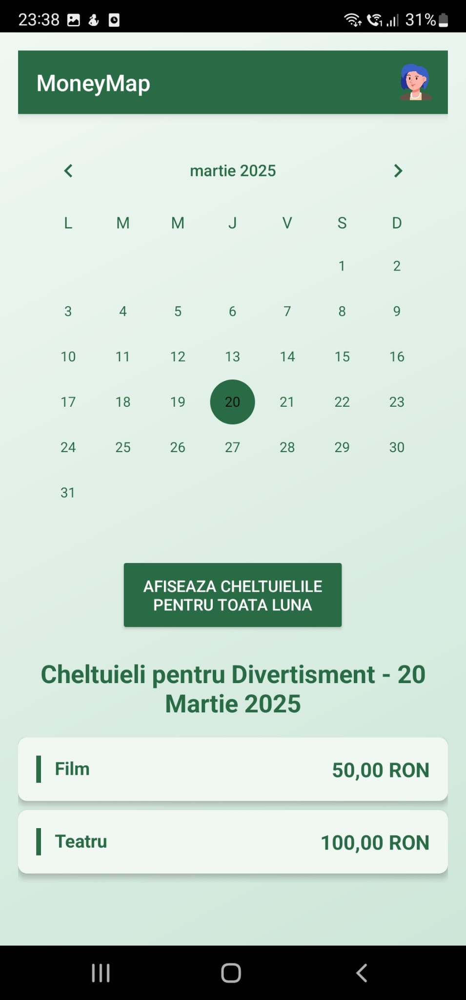

# 💸 MoneyMap  

## Your personal finance companion, designed to give you a clear overview of your income and expenses  

## 👩🏻‍💻 Team Members  
- [Popeangă Antonia](https://github.com/antoniapopeanga)  
- [Popa Jasmine](https://github.com/jasminepopa3)  

## 📊 Epic story
MoneyMap simplifies personal finance management by providing users with a clear and intuitive way to track their expenses, monitor income, and gain valuable insights into their spending habits. With seamless data synchronization and real-time updates, it empowers users to take control of their financial future with confidence.  

---  

## 🔍 Preview  

<div style="display: flex; justify-content: space-between;">
    
    
    
    
    
</div>

---

## ✨ Core Features  

### 🗓 **Monthly Overview**  
- Interactive calendar showing **total expenses** vs **total budget**  
- Quick navigation to all key sections  

### 📑 **Categories Management**  
- Customizable categories with:  
  - Personalized names & descriptions  
  - Color-coding system  
- Easy add/edit functionality  

### 💰 **Budget Planning**  
- Set monthly budgets per category  
- Visualize allocations for any selected month & year  

### 💸 **Expense Tracking**  
#### Summary View:  
- Progress bars showing spending vs budget on each category
- Filter by month & year
  
#### Detailed View:  
- Daily expense breakdown  
- Add new expenses with:  
  - Date picker  
  - Category selector  
  - Amount input  

### 📊 **Profile Dashboard**  
- Custom profile avatar  
- Circular chart displaying spending distribution  
- Monthly overview at a glance  

---

## 🎨 Design Principles  
✅ **Clean minimalist interface**  
✅ **Intuitive navigation**  
✅ **Visual data representation**  
✅ **Consistent color system**  

---

## 🖥️ **Tech Stack:**  
Android Studio IDE (Java) + Firebase (Database)  

---

## 🔧 Fastbot2 Testing Integration  

1. **Set Up WSL & Dependencies**:  
     ```bash
    # Install Android Command Line Tools  
    wget https://dl.google.com/android/repository/commandlinetools-linux-9477386_latest.zip -P /tmp
    unzip /tmp/commandlinetools-linux-*.zip -d ~/android-sdk/cmdline-tools
    mv ~/android-sdk/cmdline-tools/cmdline-tools ~/android-sdk/cmdline-tools/latest  
    
    # Set Environment Variables  
    echo 'export ANDROID_SDK_ROOT="$HOME/android-sdk"' >> ~/.bashrc  
    echo 'export PATH="$ANDROID_SDK_ROOT/cmdline-tools/latest/bin:$PATH"' >> ~/.bashrc  
    source ~/.bashrc  
    
    # Install Required SDK Components  
   yes | sdkmanager --sdk_root=$ANDROID_SDK_ROOT --install "platform-tools" "build-tools;33.0.2"
   yes | sdkmanager --sdk_root=$ANDROID_SDK_ROOT --install "cmake;3.18.1"
   yes | sdkmanager --sdk_root=$ANDROID_SDK_ROOT --install "ndk;25.2.9519653"
   yes | sdkmanager --licenses  
     
     ```  

2. **Install Build Tools & Java**:  
     ```bash
    # Update packages and install essentials  
    sudo apt update  
    sudo apt install -y cmake make g++ openjdk-11-jdk  
    
    # Verify installations  
    cmake --version  # Should show 3.18.1  
    java -version    # Should show OpenJDK 11
     
      ```  

3. **Build Fastbot2**:  
     ```bash
    # Navigate to Fastbot_Android folder  
    cd /path/to/Fastbot_Android  
    
    # Generate Gradle Wrapper  
    gradle wrapper  
    
    # Build JAR files  
    ./gradlew clean makeJar  
    
    # Build Native Libraries  
    sh ./build_native.sh  
     
    ```  

4. **Prepare the Emulator/Device**:  
     ```bash
     # Install ADB  
    sudo apt install adb 
    sudo apt install android-emulator
     
    # Check connected devices
    cd /path/to/AppData/Local/Android/Sdk/platform-tools
    adb.exe devices  
     
     ```  

5. **Deploy Fastbot2 to Device**:  
     ```bash
   # Push JARs and native libraries  
    adb push monkeyq.jar /sdcard/  
    adb push fastbot-thirdpart.jar /sdcard/
    adb push libs/armeabi-v7a/libfastbot.so /data/local/tmp/
    adb push libs/armeabi-v7a/libfastbot_native.so /data/local/tmp/  
    
    # Verify target app package  
    adb shell pm list packages | grep moneymap
     
      ```  

6. **Run Fastbot2 Tests**:  
     ```bash
   # Execute Fastbot (60 minutes, 300ms throttle)  
    adb shell CLASSPATH=/sdcard/monkeyq.jar:/sdcard/fastbot-thirdpart.jar \  
    app_process /system/bin com.android.commands.monkey.Monkey \  
    -p your.app.package --throttle 300 --running-minutes 60  
    
    # Save logs to a file  
    adb shell "CLASSPATH=/sdcard/monkeyq.jar app_process /system/bin com.android.commands.monkey.Monkey \  
    -p your.app.package --throttle 500 --running-minutes 60" > fastbot_logs.txt 2>&1     
     
     ```
---
     
## 📁 File Snippets

### fastbot_logs.txt
```txt
[Fastbot]*** WARNING *** 03-29 04:58:52.078 15280 15280 W [Fastbot]: *** WARNING *** %s03-24 03:45:23.063  1670  1670 D ConditionProviders.SCP: notifyCondition condition://android/schedule?days=1.2.3.4.5&start=22.0&end=7.0&exitAtAlarm=false STATE_TRUE reason=meetsSchedule
[Fastbot]*** WARNING *** 03-29 04:58:52.078 15280 15280 W [Fastbot]: *** WARNING *** %s03-24 03:45:23.063  1670  1670 D ConditionProviders.SCP: Scheduling evaluate for Mon Mar 24 07:00:00 GMT+02:00 2025 (1742792400000), in +3h14m36s937ms, now=Mon Mar 24 03:45:23 GMT+02:00 2025 (1742780723063)
[Fastbot]*** WARNING *** 03-29 04:58:52.079 15280 15280 W [Fastbot]: *** WARNING *** %s03-24 03:45:23.083  1670  1760 I ActivityManager: Start proc 9862:com.android.providers.calendar/u0a2 for content provider com.android.providers.calendar/.CalendarProvider2
[Fastbot]*** WARNING *** 03-29 04:58:52.079 15280 15280 W [Fastbot]: *** WARNING *** %s03-24 03:45:23.114  1670  1683 I UsageStatsService: Time changed in UsageStats by 619752 seconds
[Fastbot]*** WARNING *** 03-29 04:58:52.080 15630 15630 D Firestore: Number of categories fetched: 5
[Fastbot]*** WARNING *** 03-29 04:58:52.081 15630 15630 D Firestore: Category fetched: b with ID: 1Ieb3JHA1Hs1j8NOYJ5z
[Fastbot]*** WARNING *** 03-29 04:58:52.081 15630 15630 D Firestore: Category fetched: cg with ID: C7VS31GILQ9mFqR6Npzp
[Fastbot]*** WARNING *** 03-29 04:58:52.081 15630 15630 D Firestore: Category fetched: Divertisment with ID: FOtSoXJfnThUQZ1R2OaO
[Fastbot]*** WARNING *** 03-29 04:58:52.082 15630 15630 D Firestore: Category fetched: Alimente with ID: XpBYM0UDKCVNtESlGs9W
[Fastbot]*** WARNING *** 03-29 04:58:52.082 15630 15630 D Firestore: Category fetched: 5Igien5a with ID: wkNi1hGgL2Z9Fu9gmiHp

```
```txt
[Fastbot][2025-03-29 05:37:53.082] Events injected: 28981
[Fastbot][2025-03-29 05:37:53.083] // Monkey is over!
[Fastbot][2025-03-29 05:37:53.090] Total app activities:
[Fastbot][2025-03-29 05:37:53.090]    1 com.example.moneymap.BudgetActivity
[Fastbot][2025-03-29 05:37:53.090]    2 com.example.moneymap.AddExpenseActivity
[Fastbot][2025-03-29 05:37:53.090]    3 com.google.android.gms.common.api.GoogleApiActivity
[Fastbot][2025-03-29 05:37:53.090]    4 com.example.moneymap.ExpenseActivity
[Fastbot][2025-03-29 05:37:53.091]    5 com.example.moneymap.ProfileActivity
[Fastbot][2025-03-29 05:37:53.091]    6 com.example.moneymap.ExpenseDetailsActivity
[Fastbot][2025-03-29 05:37:53.091]    7 com.google.android.gms.auth.api.signin.internal.SignInHubActivity
[Fastbot][2025-03-29 05:37:53.091]    8 com.example.moneymap.AddCategoryActivity
[Fastbot][2025-03-29 05:37:53.091]    9 com.google.firebase.auth.internal.GenericIdpActivity
[Fastbot][2025-03-29 05:37:53.091]   10 com.google.firebase.auth.internal.RecaptchaActivity
[Fastbot][2025-03-29 05:37:53.091]   11 com.example.moneymap.AvatarSelectionActivity
[Fastbot][2025-03-29 05:37:53.091]   12 com.example.moneymap.RegisterActivity
[Fastbot][2025-03-29 05:37:53.091]   13 com.example.moneymap.LoginActivity
[Fastbot][2025-03-29 05:37:53.091]   14 com.example.moneymap.HomeActivity
[Fastbot][2025-03-29 05:37:53.091]   15 com.example.moneymap.MainActivity
[Fastbot][2025-03-29 05:37:53.092]   16 com.example.moneymap.CategoryActivity
[Fastbot][2025-03-29 05:37:53.093] Explored app activities:
[Fastbot][2025-03-29 05:37:53.093]    1 com.example.moneymap.AddCategoryActivity
[Fastbot][2025-03-29 05:37:53.093]    2 com.example.moneymap.AddExpenseActivity
[Fastbot][2025-03-29 05:37:53.093]    3 com.example.moneymap.BudgetActivity
[Fastbot][2025-03-29 05:37:53.093]    4 com.example.moneymap.CategoryActivity
[Fastbot][2025-03-29 05:37:53.094]    5 com.example.moneymap.ExpenseActivity
[Fastbot][2025-03-29 05:37:53.094]    6 com.example.moneymap.HomeActivity
[Fastbot][2025-03-29 05:37:53.094]    7 com.example.moneymap.LoginActivity
[Fastbot][2025-03-29 05:37:53.095]    8 com.example.moneymap.MainActivity
[Fastbot][2025-03-29 05:37:53.095] Activity of Coverage: 50.0%


